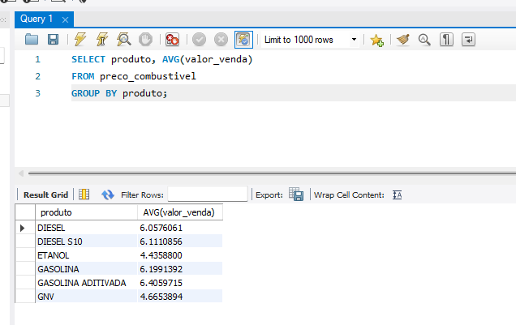

# Pipeline de Dados - Preços de Combustíveis no Brasil 

Este projeto implementa um pipeline de engenharia de dados para coletar, processar e visualizar dados de preços de combustíveis no Brasil.

O objetivo é demonstrar um fluxo completo de dados, desde a extração do dataset até a visualização em dashboards.


# ⚠️ Projeto em desenvolvimento. ⚠️

---

# Arquitetura do Pipeline

Fluxo de dados do projeto:

Dataset ANP (CSV) ➜
Python (extração e transformação) ➜
MySQL (armazenamento) ➜
Apache NiFi (orquestração do pipeline) ➜
Apache Superset (visualização de dados)

---

# Tecnologias Utilizadas

* Python
* Pandas
* MySQL
* Apache NiFi
* Apache Superset
* Git / GitHub

---

# Estrutura do Projeto

```
Projeto-Pipeline-Dados-Combustiveis-Brasil
│
├── data
│   ├── raw
│   ├── processed
│   └── zip
│
├── python
│   ├── extractor
│   │   └── download_data.py
│   ├── transform
│   │   └── transformar_csv.py
│
├── nifi
│   └── pipeline_config
│
├── dashboards
│
├── docs
│
├── images
│
└── README.md
```

---

# Exemplo de Análise SQL

Consulta para calcular o preço médio por combustível:

```sql
SELECT produto, AVG(valor_venda) AS preco_medio
FROM preco_combustivel
GROUP BY produto;
```


---

# Roadmap do Projeto

* [x] Download do dataset da ANP
* [x] Transformação de dados com Python e Pandas
* [x] Inserção dos dados no MySQL
* [ ] Construção do pipeline no Apache NiFi
* [ ] Criação de dashboards no Apache Superset
* [ ] Automação do pipeline
* [ ] Deploy com Docker

---

# Objetivo do Projeto

Este projeto foi criado como parte de um portfólio de estudos em Engenharia de Dados para demonstrar habilidades em:

* Construção de pipelines de dados
* Transformação e limpeza de dados com Python e Pandas
* Armazenamento e consultas em bancos de dados SQL
* Orquestração de pipelines de dados
* Visualização de dados em dashboards
