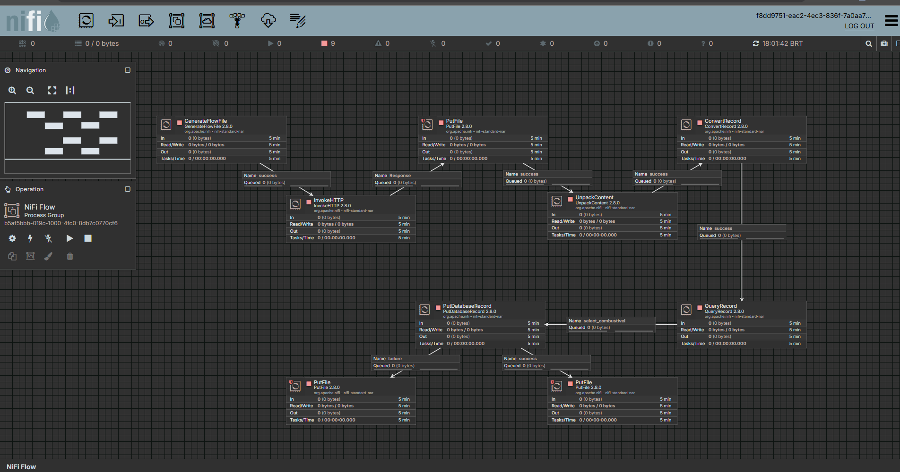
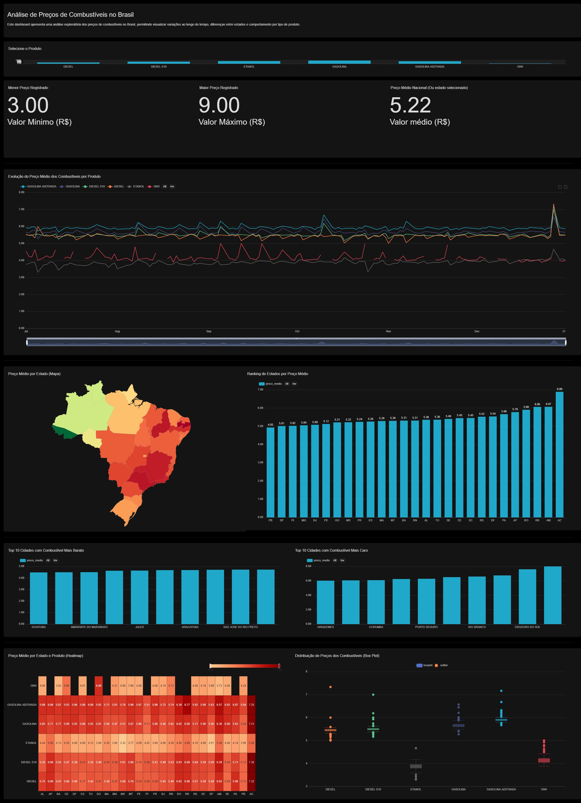

# Pipeline de Dados - Preços de Combustíveis no Brasil

# Visão Geral
Este projeto implementa um pipeline completo de engenharia de dados para coletar, processar e visualizar dados de preços de combustíveis no Brasil, utilizando ferramentas modernas do ecossistema de dados.

O objetivo é demonstrar um fluxo completo de dados, desde a extração do dataset até a visualização em dashboards interativos para análise.

---

# Fonte dos Dados

Os dados são disponibilizados pela Agência Nacional do Petróleo (ANP):

[Link de download no formato .zip contendo o .csv](https://www.gov.br/anp/pt-br/centrais-de-conteudo/dados-abertos/arquivos/shpc/dsas/ca/ca-2025-02.zip)

Frequência: periódica (semestral)
---

# Arquitetura do Projeto

Fluxo geral:

Fonte (ANP)
   ↓
Apache NiFi (Ingestão e Orquestração)
   ↓
MySQL (Armazenamento)
   ↓
Apache Superset (Visualização)
---

# Arquitetura:

# Pipeline de Dados
Orquestração com Apache NiFi
O pipeline no Apache NiFi é responsável por automatizar todo o fluxo:

#Etapas do fluxo:

*GenerateFlowFile
  Dispara o pipeline periodicamente
*InvokeHTTP
  -Realiza download do arquivo .zip diretamente da ANP
*PutFile (zip)
  -Armazena o arquivo bruto
*UnpackContent
  -Extrai o conteúdo do .zip
*ConvertRecord
  -Converte CSV → JSON
*QueryRecord
  -Realiza transformações:
    -Renomeação de colunas
    -Conversão de datas
    -Conversão de valores numéricos
    -Padronização de schema
*PutDatabaseRecord
  -Insere os dados no banco MySQL
  -Tratamento de erros
  -Registros com falha são direcionados para pasta error

---
# Extração e Transformação com Python
Antes da orquestração com NiFi, foi desenvolvido um pipeline em Python para demonstrar domínio de ETL manual.
  *Principais transformações:
    -Renomeação de colunas
    -Remoção de colunas irrelevantes
  *Conversão de:
    -Datas
    -Valores monetários (vírgula → ponto)
  *Tratamento de valores nulos

# Bibliotecas utilizadas:
  *pandas
  *mysql-connector
  *pathlib
  *requests
  *zipfile

---
# Banco de Dados
Foi utilizado o MySQL como camada intermediária para armazenamento estruturado.

  *Tabela principal:
    -preco_combustivel

#Visualização de Dados
Os dados são consumidos pelo Apache Superset, executado via Docker.

---
#Análises Disponíveis
O dashboard permite explorar:
  *Evolução do preço médio por tipo de combustível
  *Preço médio por estado (mapa)
  *Ranking de estados por preço médio
  *Top 10 cidades mais baratas
  *Top 10 cidades mais caras
  *Heatmap por estado e produto
  *Distribuição de preços (boxplot)

---

# Tecnologias Utilizadas
  *Python
  *Apache NiFi
  *MySQL
  *Apache Superset
  *Docker
  *Git/Github

---

# Estrutura do Projeto
├── data/
│   ├── raw/
│   ├── processed/
│   ├── error/
│   └── zip/
├── database/
│   └── create_tables.sql
├── docs/
├── images/
├── nifi/
│   └── NiFiFlow.json
├── python/
│   ├── extractor/
│   ├── transform/
│   └── loader/
├── README.md
└── requirements.txt

---

# Como Executar
1. Clonar repositório
git clone https://github.com/DaniloGaldinoo/Projeto-Pipeline-de-dados-combustiveis-brasil.git
cd Projeto-Pipeline-de-dados-combustiveis-brasil
2. Banco de dados (MySQL)
CREATE DATABASE combustiveis_anp;
  Execute:
  database/create_tables.sql
3. Rodar o Apache NiFi
    Inicie o NiFi
    Importe o fluxo:
    nifi/NiFiFlow.json
      *Configure:
        -conexão com MySQL (DBCPConnectionPool)
4. Rodar o Superset (Docker)
5. Executar o pipeline
  -Inicie o fluxo no NiFi
    -Os dados serão automaticamente:
      -Baixados
      -Processados
      -Inseridos no banco

# Melhorias Futuras
  -Containerização completa do pipeline (Docker Compose)
  -Automatização com scheduler (NiFi avançado)

---
Este projeto foi criado como parte de um portfólio de estudos em Engenharia de Dados para demonstrar habilidades em:

* Construção de pipelines de dados
* Transformação e limpeza de dados com Nifi / Python e Pandas
* Armazenamento e consultas em bancos de dados SQL
* Orquestração de pipelines de dados
* Visualização de dados em dashboards
